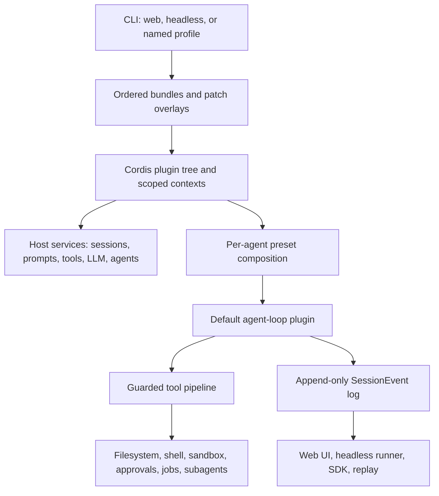

# DeepSeek Harness Report

> Date: 2026-08-15  
> Tags: `dsh`, `dagi`, `codex`, `agent-architecture`, `prompt-caching`  
> Scope: DeepSeek Harness `master` as inspected on 2026-08-15; DAGI's current documented
> architecture; and the public OpenAI Codex runtime and app-server. Codex cloud internals are
> outside scope.

## Executive summary

DeepSeek Harness (`dsh`) is best understood as a composable operating system for agents. Its
central architectural bet is that the model adapter, tools, agent loop, persistence, prompts,
sandbox, approvals, subagents, and user interfaces should all be composable plugins rather than
privileged, hard-wired subsystems.

DAGI and Codex occupy different positions:

- **dsh** asks: how can every agent subsystem be replaced, scoped, composed, and unloaded?
- **DAGI** asks: what is the smallest understandable autonomous coding system its owner can fully
  control and evolve?
- **Codex** asks: how can a reliable and secure coding agent be delivered across CLI, desktop,
  IDE, and cloud surfaces?

The most valuable dsh ideas for DAGI are not a wholesale Cordis-style rewrite. They are:

1. Formal session, turn, and step semantics.
2. A typed append-only session event log with a replaceable model-visible surface.
3. An explicit tool pipeline separating policy, execution, post-processing, and durability.
4. Cache-aware compaction that replays the existing request prefix verbatim.
5. Provider-based subagents with explicit fresh, forked, and resumable behavior.
6. Capability seams at unstable integration boundaries.
7. Effective-configuration introspection comparable to `dsh --dump-config`.
8. Request-level cache observability and cache-break attribution.

## 1. Overall philosophy

The repository describes its design as **"everything is a plugin."** dsh is powered by Cordis,
which combines four roles in one runtime context:

- A scoped service registry.
- A dependency-injection system.
- A typed event bus.
- A lifecycle manager for reversible registrations and side effects.

Cordis calls the underlying property *spatiotemporal composability*:

- **Spatial composability** means that a plugin declares which services it needs and resolves
  those services through a context. Different scopes can expose different implementations.
- **Temporal composability** means that a plugin's registrations are reversible effects. When the
  plugin unloads, its services, tools, event listeners, and prompt sections unwind predictably.
- **Reactive dependencies** allow a plugin to activate when required services exist rather than
  relying entirely on manually maintained boot order.

The result is a system where the default agent loop is important but is still a plugin satisfying
an agent interface. Extending dsh generally means mounting a sibling plugin at a documented event
or service seam rather than patching the loop.

### Architectural trade-off

This design provides exceptional replaceability and ecosystem potential, but it carries a large
complexity tax: many services, scopes, packages, events, configuration rows, generated catalogs,
and lifecycle rules must be understood together. That trade is justified for an agent platform.
It is not automatically justified for DAGI while DAGI's primary advantage is inspectability and
rapid owner-driven experimentation.

## 2. Composition and boot architecture

A running dsh installation is assembled from ordered layers:

1. The `dsh-base` bundle.
2. A product bundle such as `dsh-web-app` or `dsh-headless`.
3. The selected profile's `cordis.patch.yml`.
4. The user's home-level patch.
5. Optional command-line patch overlays.

The Web UI and headless runner therefore do not require separate agent cores. They are different
compositions of the same plugin system. `dsh --dump-config` prints the exact effective plugin tree
that will boot.

One limitation is that a patch replaces a complete row configuration rather than deep-merging it.
Overrides can therefore become verbose or brittle.



## 3. Sessions, turns, and steps

The useful hierarchy is:

```text
Session
└── Turn: one admitted unit of work
    ├── Step: one model request plus its requested tool executions
    ├── Step: the next model request plus its tools
    └── Step: a final model request, possibly with no tools
```

A step is not simply an HTTP attempt. Provider retries can occur inside a logical step. A turn is
not necessarily one user message. It can begin from a queued follow-up, a background report, or a
goal-continuation message.

### 3.1 Step semantics

dsh defines a step as one model request plus all tool executions requested by that response. The
step ends only after its requested tool calls have settled and their results have been recorded.

Features tied to the step boundary include:

| Feature | Step-level purpose |
|---|---|
| Prompt assembly | Assemble system prompt, tool schemas, history, and route for each request. |
| `agent/pre-step` | Admit, reject, or rewrite messages before request derivation. |
| Compaction pressure | Check context size at a safe boundary before the next request. |
| Request-header logging | Record the exact request prefix and call configuration. |
| Streaming | Associate assistant chunks with one request coordinate. |
| Usage accounting | Attribute provider usage and cache buckets to a completed request. |
| Tool grouping | Bind all calls from one assistant response to the same step. |
| Parallel execution | Overlap parallel-safe calls while exclusive calls form barriers. |
| Request recovery | Retry or repair a failed request using its step coordinates. |
| UI observability | Present thinking, tool activity, and completion as one request cycle. |

Compaction at the pre-step boundary is particularly important. The previous assistant message and
its tool results are complete, so dsh never has to summarize an unresolved assistant/tool group.

### 3.2 Turn semantics

A turn opens before input is claimed and closes when the agent owes no further work. It may contain
zero steps if pre-step admission rejects the input or produces an empty batch.

Features tied to the turn boundary include:

| Feature | Turn-level purpose |
|---|---|
| Input admission | A waking message opens a turn and claims queued work. |
| Follow-up vs steering | Follow-up targets the next turn; steering targets the next step. |
| Cancellation | One cancellation signal owns the active turn. |
| Terminal outcome | Persist completed, blocked, max-tokens, aborted, error, or interrupted. |
| `agent/turn-stopping` | Allow terminal policy to observe or extend natural completion. |
| Safe forking | Copy a parent only through a completed `turn/end`. |
| Crash recovery | Mark an orphaned open turn as interrupted. |
| Compaction ownership | Identify the open turn that owns a compaction transaction. |
| UI state | Distinguish an active turn from an idle session. |

dsh distinguishes three input paths:

- `followup()` appends to a next-turn queue and wakes the agent.
- `steer()` appends to the next-step inbox and wakes the current activity.
- `inject()` appends to the next-step inbox without waking an idle agent.

dsh has no built-in maximum number of steps per turn. A lifecycle policy can impose one.

### 3.3 Proposed DAGI mapping

A conservative DAGI mapping would be:

- One `AgentLoop.run(task)` activity is one turn.
- Every LLM request is one step.
- The assistant's tool batch and all resulting tool messages belong to that step.
- `max_continuations` becomes an explicit step budget or is replaced by one.
- `<<END_OF_RESPONSE>>`, `<<TASK_END>>`, cancellation, error, and budget exhaustion map to typed
  turn-end reasons.
- Every subagent owns a separate session with its own turns and steps. Its invocation remains a
  tool call inside one parent step.

The minimum useful event vocabulary is:

```text
turn/start
step/start
request/header
user/message
assistant/chunk
assistant/message
tool/call
tool/result
step/end
turn/end
```

This vocabulary can initially be added without changing loop behavior. Prompt derivation,
compaction, and replay can migrate onto it later.

## 4. Typed append-only session event log

dsh separates three concepts:

```text
Raw event log: immutable historical facts
Surface: current ordered model-visible projection
Derived messages: request-ready LLM history generated from the surface
```

### 4.1 Raw log

Every event has a typed envelope containing a contiguous sequence number, timestamp, type, and
JSON-serializable data. Accepted values are validated, snapshotted, and frozen.

Representative event types include:

- `turn/start`, `turn/end`
- `step/start`, `step/end`
- `request/header`, `request/context`
- `user/message`
- `assistant/chunk`, `assistant/message`
- `tool/call`, `tool/result`
- `compaction/start`, `compaction/summary`, `compaction/end`
- `approval/asked`, `approval/decided`
- `llm/retry`, hook events, and UI projection events

In TypeScript, a merge-extensible `SessionEventMap` lets plugins add typed event variants. A Python
DAGI implementation could use Pydantic discriminated unions plus an event-type registry.

### 4.2 Surface versus log-only events

Only events that generate model messages appear on the surface. These primarily include
`user/message`, `assistant/message`, and `tool/result`.

Raw chunks, boundaries, usage, approvals, hooks, retries, and compaction bookkeeping remain in the
log but do not consume model context.

### 4.3 Append-only replacement

Append-only persistence does not mean that model context cannot shrink. Compaction appends a new
surface event whose `surfaceOp` replaces an earlier surface span. The original events remain in the
raw log for audit and replay.

```text
seq 1   turn/start
seq 2   user/message
seq 3   step/start
seq 4   assistant/message
seq 5   tool/call
seq 6   tool/result
seq 7   step/end
seq 8   turn/end
seq 9   compaction/start
seq 10  compaction/summary
seq 11  user/message, surface replace seq 2 through seq 6
seq 12  compaction/end
```

The model now sees the checkpoint at sequence 11. The complete original interaction remains
available. `sourceEventSeqs` records exactly which earlier events produced an assembled message or
replacement checkpoint.

### 4.4 Benefits for DAGI

A typed append-only log would improve:

- Replay and resume fidelity.
- Crash recovery.
- UI consistency across live and reloaded sessions.
- Tool-call/result pairing checks.
- Exact usage and cache accounting.
- Auditable permissions and sandbox decisions.
- Safe completed-turn forks.
- Compaction failure recovery.
- Persistence backends independent of `AgentLoop` internals.

It also enables exact request reconstruction. dsh logs the actual provider/model configuration,
rendered system prompt, and tool schemas. Its compactor uses the same canonical message projection
as normal request construction, avoiding formatting drift that would destroy prefix-cache reuse.

## 5. Explicit tool execution pipeline

dsh routes model tool calls through a structured pipeline:

1. Append a durable `tool/call`.
2. Run `tools/pre-execute` policy and hooks.
3. Resolve approval and sandbox decisions.
4. Apply monotonic guards.
5. Run `tools/execute` wrappers such as timeout or metrics.
6. Execute the tool body.
7. Run `tools/post-execute` result policy.
8. Normalize and finalize the canonical result.
9. Notify final-result observers.
10. Append the durable `tool/result`.

This separates capability from policy. A filesystem tool does not need to own approval UX,
sandbox construction, metrics, result filtering, and durable recording itself.

A DAGI pipeline should similarly distinguish:

- Preflight validation and policy.
- Approval and confinement.
- Actual execution.
- Post-processing and result replacement.
- Durable final outcome.

## 6. Prefix-cache principles

Provider prompt caches operate on exact leading token sequences, not semantic equivalence.

```text
Request 1: [system][tools][messages 1–100]
Request 2: [system][tools][messages 1–100][new result]
```

Request 2 can reuse the entire earlier prefix. If a timestamp, active plan, tool description, or
summary instruction changes near the beginning, every token after the change becomes uncached.

dsh's general cache discipline includes:

1. Deterministic system-prompt sections.
2. Stable tool-schema ordering.
3. Append-only ordinary history growth.
4. Dynamic information appended instead of inserted near the front.
5. Durable logging of the exact request header.
6. Stable per-session prompt and tool composition.
7. Explicit documentation of each package's token and KV-cache effect.
8. Deliberate, identifiable replacement events for unavoidable invalidation.

DAGI previously violated this rule by rewriting `_messages[0]` with the active plan board. Moving
that dynamic content to the conversation tail was the correct fix. Memory recall, progress state,
dynamic AGENTS.md discoveries, and per-call subagent briefings should follow the same principle.

### 6.1 Better cache metrics

Cache-hit percentage alone can mislead. DAGI should track:

1. Cache-read fraction: cache-read tokens divided by total prompt tokens.
2. Uncached input tokens per request.
3. Total prompt-processing cost per completed turn.

Metrics should be separated for parent conversation requests, compaction requests, fresh children,
forked children, and resumed children.

Each step should record component fingerprints:

```text
provider and model
system-prompt hash
tool-schema hash
derived-history generation and hash
compaction generation
subagent profile id
```

Cache breaks can then be classified as:

```text
SYSTEM_CHANGED
TOOLS_CHANGED
ROUTE_CHANGED
HISTORY_REPLACED
CHILD_PROFILE_CHANGED
UNKNOWN_SERIALIZATION_DRIFT
```

## 7. Cache-aware compaction

Assume the last conversation request was:

```text
R-last =
    [system]
    [tools]
    [old history selected for compaction]
    [recent history to retain]
```

A naive compactor sends:

```text
R-naive =
    [new summarizer system prompt]
    [newly rendered transcript]
```

This diverges at the first token and forfeits the warm cache. dsh previously behaved this way and
changed the design specifically to recover prefix reuse.

The current summarizer sends:

```text
R-summary =
    [same system]
    [same tools]
    [byte-identical old history]
    [trailing user compaction instruction]
```

The provider can reuse the warm prefix through the selected history. Tool schemas remain present
even though the summarizer must not call tools, because removing them would misalign every
following token. The same provider and model are used by default. Automatic head compaction is the
guaranteed prefix-aligned case; manual mid-range compaction or a different route forfeits reuse.

### 7.1 The unavoidable main-request break

After compaction, the next conversation request is:

```text
R-new =
    [same system]
    [same tools]
    [summary of old history]
    [retained recent history]
```

This necessarily diverges where the first old message was replaced. dsh limits rather than
eliminates the damage:

- The auxiliary summarization call reuses the old warm prefix.
- The new context is substantially smaller.
- The new summary remains stable.
- Following requests append to `R-new` and reuse it.
- Compaction occurs only under pressure.

Defaults are an 80% context-window compaction threshold and a 16% recent-tail retention budget.
These values are useful references, not automatically correct DAGI defaults.

### 7.2 Model-free pruning first

Before requesting a summary, dsh can replace oversized textual tool results with a bounded head,
fixed omission marker, and bounded tail. The original stays in the raw log. Defaults are:

- Prune over 8,192 text characters.
- Retain 4,096 leading characters.
- Retain 1,024 trailing characters.

Pressure is remeasured after pruning. If the request is now safe, no summarizer call occurs.

This matches DAGI's hybrid-compaction direction: remove deterministic noise and bulky tool output
first, then use an LLM only for reasoning, decisions, blockers, and user intent.

### 7.3 Recommended DAGI compaction work

1. Run pressure checks at `pre-step`.
2. Deterministically prune large and noisy tool output first.
3. Select the oldest balanced head span.
4. Retain a recent verbatim tail.
5. Reconstruct summary input from the exact prior request representation.
6. Put the compaction directive in a trailing user message.
7. Use the same provider and model by default.
8. Append a surface-replacement event instead of mutating raw history.
9. Maintain one consolidated checkpoint rather than accumulating summaries.
10. Instrument the unavoidable first post-compaction cache reset.

## 8. Subagent architecture and cache behavior

dsh exposes subagents through a provider seam. Providers include:

- Fresh in-process children.
- Completed-history in-process forks.
- ACP agents.
- Separate dsh runtimes over the SDK.
- Real Codex app-server children.
- Claude Code through the official Agent SDK.

The model-facing delegation tool is provider-independent. Changing transport does not require
changing the parent's conceptual "subagent as a tool" interface.

### 8.1 Fresh child

A fresh child receives the workspace, lineage, usually the parent model, and a standalone task. It
receives zero parent conversation messages. Its cache is independent, but parent history is not
duplicated into every child request.

Only a final result, error, or explicit report is appended to the parent. Intermediate child tool
traffic remains in the child session, preserving the parent's reusable prefix.

### 8.2 Forked child

A fork receives the parent's balanced completed-turn surface through the last `turn/end`. The
current open turn is excluded because it may contain an assistant subagent call without a matching
tool result.

Under the same provider, model, prompt, and tools, the inherited prefix may be byte-identical to the
parent's cached request. Persona changes, tool filtering, Code Mode SDK changes, or route changes
can invalidate reuse before the inherited history begins.

dsh ships forked children as one-shot rather than continuable. A continuable child receives a
child-only `report` tool and prompt section before inherited history, invalidating the parent
prefix. Fresh continuable children have no inherited parent cache to preserve.

### 8.3 Resumable children

A continuable or persistent child maintains its own append-only context across follow-up work. It
avoids repeatedly paying for fresh prompt construction and rediscovery. DAGI's existing PID-based
resume direction can exploit the same principle.

### 8.4 Parent isolation

Keeping intermediate child transcripts outside the parent helps both context size and cache
stability. A returned handoff should still be bounded and structured: a huge final report preserves
the prefix but can rapidly create pressure and trigger compaction.

### 8.5 Recommended DAGI subagent work

1. Formalize distinct `spawn`, `fork`, and `resume` semantics.
2. Create stable child profiles with fixed prompts, tools, models, and ordering.
3. Place variable task briefing and handoff requirements at the request tail.
4. Fork only through a completed parent turn.
5. Keep forked children one-shot unless the leading request is prefix-identical.
6. Use persistent or resumable children for follow-up work.
7. Keep intermediate child transcripts out of the parent.
8. Return bounded structured handoffs rather than arbitrary Markdown.
9. Account for child and parent usage separately.

## 9. Code Mode and parallel tools

Compaction and subagents are major cache factors, but Code Mode can be equally important.

In ordinary tool calling, every large intermediate result enters the conversation and is resent on
later steps. In dsh Code Mode, the model writes a small TypeScript or Python program that calls
typed tool bindings. Intermediate values remain execution-local; only printed or returned data
enters model history.

This can produce:

- Fewer model steps.
- Fewer repeated tool results.
- Slower context growth.
- Less frequent compaction.

Parallel-safe tool calls also overlap within one step while exclusive calls form ordering barriers.
This reduces the number of sequential model requests, affecting total cost even when the nominal
cache-hit percentage is unchanged.

## 10. dsh, DAGI, and Codex comparison

| Dimension | dsh | DAGI | Codex |
|---|---|---|---|
| Primary identity | Agent framework/OS plus reference product | Owner-controlled coding harness | Production coding-agent runtime and product |
| Core abstraction | Scoped Cordis plugin/service/event tree | Central Python `AgentLoop` and registry | Rust runtime with threads, turns, and items |
| Loop design | Loop satisfies a replaceable service interface | Explicit Plan → Act → Observe loop | Cohesive product runtime |
| Extensibility | Nearly every subsystem is a plugin | Python tools, skills, config, discovered subagents | Skills, MCP, plugins/apps, AGENTS, dynamic tools |
| Durable state | Append-only typed event log and surface | Messages, compaction, summaries, wiki memory | Persisted rollouts/thread store and item events |
| Subagents | Provider seam spanning in-process and external products | Isolated subprocess roles and handoffs | Native child threads and agent graph |
| Security | Swappable sandbox, approval, FS, and shell services | Project guards, boundaries, subprocess isolation | OS-specific sandbox, permissions, approvals |
| Interfaces | Web and headless profile compositions | Textual TUI, Telegram, CLI | CLI, desktop, IDE, web/cloud |
| Maturity | Developer preview with breaking changes | Experimental owner-operated project | Product-grade and broadly deployed |

Codex's public app-server exposes a persisted Thread → Turn → Item model over JSON-RPC. This
separates rich clients from the runtime without making every internal subsystem a runtime-composed
plugin.

## 11. Potential DAGI improvements

### 11.1 Typed append-only session event log

Implement a typed event log and derived model surface to improve replay, resume, observability,
crash recovery, and UI consistency.

### 11.2 Explicit tool pipeline

Separate preflight policy, approval and confinement, execution, post-processing, normalization,
final observation, and durable outcome.

### 11.3 Capability seams at unstable boundaries

Use provider interfaces where implementations are likely to vary:

- Subagents.
- Shell execution.
- Filesystem access.
- Persistence.
- Possibly sandbox and approval services.

The agent loop itself should probably remain cohesive until there is a concrete need for multiple
loop implementations.

### 11.4 Effective-configuration introspection

Add a DAGI equivalent of `--dump-config` showing:

- Root and project configuration after merging.
- Effective provider, model, and reasoning settings.
- Tool registration followed by allowlist filtering.
- Effective system-prompt inputs.
- Subagent types, presets, tools, model tiers, and AGENTS.md sources.
- Sandbox, permission, and persistence configuration.

This would make silent allowlist stripping and project overrides much easier to debug.

### 11.5 Provider-based subagents

Continue evolving the public `subagent_api` into a provider boundary supporting:

- DAGI subprocess children.
- In-process or persistent DAGI children if later justified.
- Codex app-server children.
- Claude Code children.
- ACP or other remote providers.

The model-facing abstraction should remain "subagents as tools." Provider selection and transport
belong behind the API rather than in the main loop.

### 11.6 Request and cache observability

Record step-level request fingerprints, provider cache buckets, compaction generations, and a
cache-break reason taxonomy. Expose parent, compaction, and child statistics separately in logs and
the TUI.

## 12. Suggested adoption sequence

The changes are safest in this order:

1. **Formalize semantics without behavior changes.** Add turn and step identifiers and typed
   lifecycle events around the existing loop.
2. **Add request fingerprints and cache accounting.** Establish a baseline before changing
   compaction or child prompts.
3. **Introduce an explicit tool pipeline.** Preserve existing behavior while separating stages.
4. **Create raw-log and surface projections.** Keep `_messages` compatible during migration.
5. **Implement model-free tool-result pruning.** This is deterministic and independently useful.
6. **Replace the compaction request shape.** Replay the canonical warm prefix and append the
   instruction at the tail.
7. **Formalize spawn/fork/resume providers.** Start with existing subprocess behavior, then add
   completed-turn forks and durable resume.
8. **Add effective-configuration dumping.** Make the newly explicit composition inspectable.
9. **Consider Code Mode separately.** It is valuable but materially expands the execution and
   security surface.

The unifying design principle is:

> Formal steps provide safe compaction boundaries. Formal turns provide safe fork boundaries. An
> append-only event log reconstructs exact requests. Exact reconstruction enables compaction and
> forked subagents to reuse the provider's prefix cache.

## 13. Important cautions

- dsh is in developer preview and its interfaces are explicitly unstable.
- A high cache-hit percentage is not sufficient; uncached tokens and total cost per completed turn
  also matter.
- Compaction cannot preserve the old main-request cache after replacing the first old message. It
  can only make the auxiliary request cheap and establish a smaller stable prefix afterward.
- Fresh children isolate context but may pay cold-start costs.
- Forked children obtain useful cache reuse only if everything before inherited history is
  byte-identical.
- Provider switching, prompt mutation, tool-schema mutation, and non-deterministic serialization
  all invalidate cache reuse.
- Replacing DAGI's central loop with Cordis would trade away much of DAGI's present simplicity.

## 14. Primary sources

### DeepSeek Harness

- [Repository and developer-preview notice](https://github.com/deepseek-ai/deepseek-harness)
- [Architecture](https://github.com/deepseek-ai/deepseek-harness/blob/master/docs/architecture.md)
- [Cordis primer](https://github.com/deepseek-ai/deepseek-harness/blob/master/docs/cordis-primer.md)
- [Agent lifecycle](https://github.com/deepseek-ai/deepseek-harness/blob/master/docs/agent-lifecycle.md)
- [Agent loop](https://github.com/deepseek-ai/deepseek-harness/blob/master/packages/core/agent-loop/README.md)
- [Session log](https://github.com/deepseek-ai/deepseek-harness/blob/master/packages/core/session/README.md)
- [Session event types](https://github.com/deepseek-ai/deepseek-harness/blob/master/packages/core/session/src/types.ts)
- [Tool execution pipeline](https://github.com/deepseek-ai/deepseek-harness/blob/master/docs/tool-execution-pipeline.md)
- [Basic compaction](https://github.com/deepseek-ai/deepseek-harness/blob/master/packages/compaction/compaction-basic/README.md)
- [Compaction cache-reuse fix](https://github.com/deepseek-ai/deepseek-harness/blob/master/.agents/notes/implemented/bug-fix/2026-07-21-compaction-summary-prefix-cache-reuse.md)
- [Tool-result pruner](https://github.com/deepseek-ai/deepseek-harness/blob/master/packages/compaction/compaction-tool-result-pruner/README.md)
- [Token meter](https://github.com/deepseek-ai/deepseek-harness/blob/master/packages/llm/token-meter/README.md)
- [Subagent packages](https://github.com/deepseek-ai/deepseek-harness/blob/master/packages/subagent/README.md)
- [Fresh child provider](https://github.com/deepseek-ai/deepseek-harness/blob/master/packages/subagent/subagent-spawn-in-process/README.md)
- [Forked child provider](https://github.com/deepseek-ai/deepseek-harness/blob/master/packages/subagent/subagent-fork-in-process/README.md)
- [Subagent report tool](https://github.com/deepseek-ai/deepseek-harness/blob/master/packages/subagent/tool-subagent-report/README.md)
- [Profiles and CLI](https://github.com/deepseek-ai/deepseek-harness/blob/master/apps/cli/README.md)
- [Cordis paper](https://github.com/cordiverse/paper)

### Codex

- [OpenAI Codex repository](https://github.com/openai/codex)
- [Codex app-server protocol](https://github.com/openai/codex/blob/main/codex-rs/app-server/README.md)
- [Official Codex documentation](https://developers.openai.com/codex)

### Existing DAGI memory references consulted

- `wiki/projects/driverless-agi/context.md`
- `wiki/projects/driverless-agi/hybrid-compaction-pipeline.md`
- `wiki/projects/driverless-agi/passive-memory-recall-design.md`
- `wiki/projects/driverless-agi/subagent-architecture-comparison.md`
- `wiki/todos/todo_012_dagi-reasonix-style-prefix-cache-optimiz.md`
- `wiki/todos/todo_014_dagi-hybrid-compaction-pipeline-pi-vcc-i.md`
- `wiki/todos/todo_015_dagi-adopt-pi-observational-memory-patte.md`
