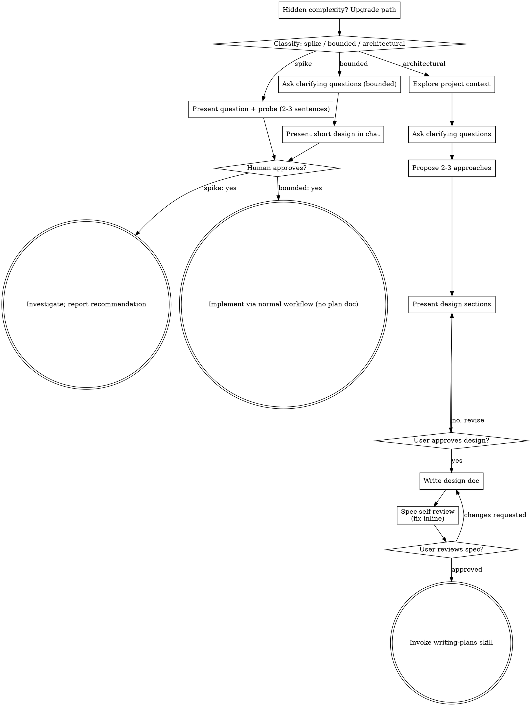

# Proposed workflow change list — 2026-09-20

Status: points 1 and 2 approved and implemented on 2026-09-20 at the skill-instruction
level. `enter-workflow` now owns transitions, approvals, and closure. The obsolete
`/plan` skill has been removed in favor of `write-plan`. The remaining recommendations
are pending. The `do-TDD` and
`merging-git-branch` samples remain drafts and are not integrated.

Ownership transfer also moved writer approval/attachment and delivery closure into the
owner, preserving existing review/wiki gates and removing obsolete show_plan/step calls.
Plan format, full resume design, branch policy, and the complete proposed cycle below
remain unfinished; this is not a claim that every related checklist item is complete.

## Proposed cycle

System prompt -> new request -> enter-workflow -> wiki-query and project exploration
-> grill-me -> design and Git-scope approval -> record parent and create task branch
-> write-spec -> user spec review -> write-plan -> independent plan review
-> user plan approval -> approval wiki-add -> attach approved plan
-> deliver (implementer uses do-TDD -> task review, repeated per task)
-> integrated verification and final review -> record verified delivery
-> merging-git-branch (offer named target -> explicit user choice -> merge/check or retain)
-> record final outcome, update project context, detach.

TDD is inside implementation, not a separate phase that finishes before implementation.
Merging follows verified delivery. Leaving a branch unmerged can be an intentional,
successful outcome; failed verification or an unresolved merge is not completion.

## Changes to make

1. **Implemented: give enter-workflow ownership of the cycle.** Make it call each stage and handle
   the return. Writer skills produce artifacts; deliver produces verified implementation;
   merging-git-branch produces the finishing outcome. Avoid nested lifecycle launches.
2. **Implemented: fix skill names and obsolete paths.** Change `write-plans` to `write-plan`, remove
   the deleted `to-spec` reference, and remove the old `/plan` skill in favor of
   `write-plan`. Keep standalone plan writing from starting implementation.
3. **Define entry and resume behavior in the system prompt.** Route genuinely new work
   through enter-workflow; approval answers and follow-ups resume the recorded stage.
   Read active plan state before restarting, replacing, or resuming a task.
4. **Make exploration include wiki-query first.** Share one lookup across the overall
   task. Preserve approval/completion wiki-add, retries, main-agent ownership, and
   failure handling from the existing lifecycle; do not postpone first lookup to deliver.
5. **Make Git approval concrete.** Include task-branch creation and task-scoped commits
   in the design approval proposal. Record parent branch, task branch, and artifact
   directory before switching. Handle dirty work, existing branches, and interrupted
   setup explicitly. Never assume the parent is main. Merge approval stays separate.
6. **Finish write-spec's saving contract.** Accept the chosen artifact directory, save
   spec.md, report readiness/blockers, and return to enter-workflow for user review.
   Reuse one directory on resume; do not recompute it from the current date.
7. **Make write-plan a writer.** Remove its direct deliver call and copied Step 7/8
   jumps. Return the written plan to the owner for review and approval. Replace the
   unregistered show_plan call with supported file display (show_file where available,
   otherwise the normal response mechanism) and a single ask_user approval step.
8. **Align the plan with its consumers.** For the smallest migration, retain Context,
   Approach, Notes, marked task headings, task Goal/Requirements/Acceptance Criteria,
   Tests, and integrated Verification. Put global constraints and the spec reference
   in extracted context, or deliberately update worker extraction to carry new sections.
   Do not assume step checkboxes alone track task acceptance.
9. **Preserve independent plan review.** Review and repair the plan before final user
   approval. Attachment alone is not approval/review evidence. Deliver must check the
   approved plan, review result, correct branch, and successful approval wiki-add.
10. **Narrow deliver to execution and verification.** Remove duplicate grilling/planning
    ownership. Keep worker/reviewer loops, status updates, integrated tests, and final
    review. Return a verified result to enter-workflow without prematurely detaching.
11. **Integrate do-TDD inside each implementation assignment.** Have the worker (or main
    implementer) load the skill and return red/green evidence with its handoff. Check
    worker skill availability when wiring it. Review/acceptance remains with deliver;
    wiki operations remain with the main agent. The runtime name is currently `do-tdd`.
12. **Add merging-git-branch after verified delivery.** Supply task/parent branches and
    current verification evidence. Offer merge or retain, ask explicit confirmation of
    the named target, verify after merging, then return the precise outcome. Keep push,
    deletion, strategy, conflict handling, and cleanup policy explicit rather than inferred.
13. **Close only after the finishing decision.** Persist awaiting-merge/left-unmerged/
    merged/blocked status and verification evidence so resumption is unambiguous. Record
    final wiki status and update AGENTS as needed before detaching. Do not rerun delivery
    merely because the user postponed merging.
14. **Resolve the bounded-path exception.** Recommend the same lifecycle for code changes,
    with shorter specs/plans and proportionate tests. Alternatively retain a clearly
    documented lightweight path with approval and verification; do not silently skip
    review. Classify by intended output/risk, not phrases such as "can we" or "quick".
15. **Reconcile artifact location and validate the whole handoff.** The new skills use
    wiki/plans while older guidance keeps execution plans separate. Choose one location
    and align all guidance. Check exact skill loading, worker context, approval/resume,
    direct planning/delivery, and merge-decline/failure paths before calling migration done.

## Draft skills now available

- [do-TDD](.dagi/skills/do-TDD/SKILL.md): minimal red/green/refactor sample.
- [merging-git-branch](.dagi/skills/merging-git-branch/SKILL.md): minimal finishing sample.

Detailed contents and workflow integration remain for review. The notes below are
earlier brainstorming/reference material, not the implemented lifecycle.

# Earlier structure
1. brainstorm
2. grill-me
3. spec
4. plan
5. tdd
6. execute plan
7. 

# notepad
## Session Lifecycle

**Project context:** `AGENTS.md` is the compact operational briefing.
Only the main agent updates it through `update-project-context`; preserve standing rules.
Architecture, workflows, decisions, business context, errors, and notes live in project wiki.
README is a downstream project description. Execution plans remain separate.

**Project wiki lifecycle (main agent only):**
- Before every overall substantive task invoke `wiki-query`; use its subagent handoff.
  Chained skills share that lookup. Do not repeat it automatically for each subtask.
- After overall plan approval invoke `wiki-add` with selected decisions and user choices.
  After full completion/verification invoke it with actual implementation and completion status.
  Main agent chooses points; writer chooses placement. No exact plan link is required.
- Encourage discretionary queries/adds for substantial questions, bugs, fixes, and findings.
- Retry required wiki failures once. Query/approval failure blocks dependent work;
  completion-write failure leaves workflow incomplete. Report partial and optional failures.
  Empty initialized wiki permits investigation; missing wiki needs code-based `/init`.
- No subagent may launch another agent. Children request wiki operations in their handoffs.
  Query/add only access wiki; main agent receives their results without traversing wiki itself.
- `wiki-refresh` is explicitly invoked and runs in main agent, which investigates code/project
  evidence and asks the user when needed. Never delegate or automatically run refresh.
- Personal knowledge-base reads/writes happen only when explicitly requested by the user.

# Brainstorming
---
name: brainstorming
description: "You MUST use this before any creative work - creating features, building components, adding functionality, or modifying behavior. Explores user intent, requirements and design before implementation."
---

# Brainstorming Ideas Into Designs

Help turn ideas into fully formed designs and specs through natural collaborative dialogue.

Start by classifying how much process the request needs, then work
through your path: understand the context, refine the idea, present a
design, and get your user's approval.

<HARD-GATE>
Do NOT invoke any implementation skill, write any code, scaffold any
project, or take any implementation action until you have told your
user what you intend and they have approved it. This applies
to EVERY task on EVERY path below — the ceremony scales with the task;
the approval gate never does.
</HARD-GATE>

## Three Paths

Before your first question, classify the request and say the
classification out loud — "this looks bounded, so I'll present a short
design here rather than write a spec" — so your user can
override it:

- **Spike** — a feasibility question ("can we...", "is it possible...",
  "quick and dirty is fine") whose output is an answer, not code you
  keep. Present the question and what you'll try in 2-3 sentences, get
  a nod, then find out as cheaply as correctness allows. No design
  doc, no spec file. Report findings as a recommendation; anything you
  built stays labeled throwaway.
- **Bounded** — a well-scoped change to code that already exists in
  this repo: a new flag, a small endpoint, a one-file fix.
  Understanding the kind of app is not enough — bounded means the flow
  you are changing is already here to read. If there is no existing
  flow to change, the task is not bounded. Ask the clarifying
  questions that matter, present a short design IN CHAT (a few
  sentences to a few short paragraphs), and STOP. Implementation
  starts only after your user says yes to that design — a
  bounded task's approval is as hard a gate as an architectural
  one. No spec file, no implementation plan document.
- **Architectural** — new projects, new subsystems, changes that
  restructure how components fit together or alter interfaces others
  depend on. Follow the full process: questions, approaches, sectioned
  design, written spec, then the writing-plans skill.

When in doubt between two paths, take the heavier one. Hidden complexity discovered mid-task upgrades the path — stop, say so, and step up. Nothing downgrades mid-task.

## Anti-Pattern: "Too Simple To Need Approval"

Every path ends with your user approving your intent before
implementation. You MUST present it and get approval.

## Checklist

Classify first, announce the path, then create a task for each item on
your path and complete them in order.

**Spike:**
1. **Explore project context** — enough to frame the probe
2. **Present question + probe plan** — 2-3 sentences
3. **Get approval** — a nod is enough
4. **Investigate** — as cheaply as correctness allows
5. **Report findings** — a recommendation; label anything built as throwaway

**Bounded:**
1. **Explore project context** — check files, docs, recent commits
2. **Ask clarifying questions** — invoke the `grill-me` skill
3. **Present short design in chat** — approach, files touched, testing
4. **Get approval** — STOP and wait for an explicit yes
5. **Implement** — proceed with the normal development workflow (TDD applies); no plan document

**Architectural:**
1. **Explore project context** — check files, docs, recent commits
2. **Ask clarifying questions** — invoke the `grill-me` skill
3. **Propose 2-3 approaches** — with trade-offs and your recommendation
4. **Present design** — in sections scaled to their complexity, get user approval after each section
5. **Write design doc** — save to `docs/superpowers/specs/YYYY-MM-DD-<topic>-design.md` and commit
6. **Spec self-review** — quick inline check for placeholders, contradictions, ambiguity, scope (see below)
7. **User reviews written spec** — ask user to review the spec file before proceeding
8. **Transition to implementation** — invoke writing-plans skill to create implementation plan

## Process Flow



**Terminal states are path-bound.** Architectural: the ONLY skill you
invoke after brainstorming is writing-plans — never frontend-design,
mcp-builder, or any other implementation skill. Bounded: after
approval, implementation proceeds directly through the normal
development workflow; no plan document. Spike: the terminal state is a
reported recommendation.

## The Process

The subsections below serve the bounded and architectural paths (a
spike stops at "present the probe, get a nod"). Sections from
**Exploring approaches** onward are architectural-path depth — for
bounded work, context plus a few questions plus a short in-chat design
is the whole process.

**Understanding the idea:**

- Check out the current project state first (files, docs, recent commits)
- Before asking detailed questions, assess scope: if the request describes multiple independent subsystems (e.g., "build a platform with chat, file storage, billing, and analytics"), flag this immediately. Don't spend questions refining details of a project that needs to be decomposed first.
- If the project is too large for a single spec, help the user decompose into sub-projects: what are the independent pieces, how do they relate, what order should they be built? Then brainstorm the first sub-project through the normal design flow. Each sub-project gets its own spec → plan → implementation cycle.
- For appropriately-scoped projects, ask questions one at a time to refine the idea
- Prefer multiple choice questions when possible, but open-ended is fine too
- Only one question per message - if a topic needs more exploration, break it into multiple questions
- Focus on understanding: purpose, constraints, success criteria

**Exploring approaches:**

- Propose 2-3 different approaches with trade-offs
- Present options conversationally with your recommendation and reasoning
- Lead with your recommended option and explain why
- YAGNI ruthlessly - remove unnecessary features from every approach and design

**Presenting the design:**

- Once you believe you understand what you're building, present the design
- Scale each section to its complexity: a few sentences if straightforward, up to 200-300 words if nuanced
- Ask after each section whether it looks right so far
- Cover: architecture, components, data flow, error handling, testing
- Be ready to go back and clarify if something doesn't make sense

**Design for isolation and clarity:**

- Break the system into smaller units that each have one clear purpose, communicate through well-defined interfaces, and can be understood and tested independently
- For each unit, you should be able to answer: what does it do, how do you use it, and what does it depend on?
- Can someone understand what a unit does without reading its internals? Can you change the internals without breaking consumers? If not, the boundaries need work.
- Smaller, well-bounded units are also easier for you to work with - you reason better about code you can hold in context at once, and your edits are more reliable when files are focused. When a file grows large, that's often a signal that it's doing too much.

**Working in existing codebases:**

- Explore the current structure before proposing changes. Follow existing patterns.
- Where existing code has problems that affect the work (e.g., a file that's grown too large, unclear boundaries, tangled responsibilities), include targeted improvements as part of the design - the way a good developer improves code they're working in.
- Don't propose unrelated refactoring. Stay focused on what serves the current goal.

## After the Design (architectural path)

**Documentation:**

- Write the validated design (spec) to `docs/superpowers/specs/YYYY-MM-DD-<topic>-design.md`
  - (User preferences for spec location override this default)
- Use elements-of-style:writing-clearly-and-concisely skill if available
- Commit the design document to git

**Spec Self-Review:**
After writing the spec document, look at it with fresh eyes:

1. **Placeholder scan:** Any "TBD", "TODO", incomplete sections, or vague requirements? Fix them.
2. **Internal consistency:** Do any sections contradict each other? Does the architecture match the feature descriptions?
3. **Scope check:** Is this focused enough for a single implementation plan, or does it need decomposition?
4. **Ambiguity check:** Could any requirement be interpreted two different ways? If so, pick one and make it explicit.

Fix any issues inline. No need to re-review — just fix and move on.

**User Review Gate:**
After the spec review loop passes, ask the user to review the written spec before proceeding:

> "Spec written and committed to `<path>`. Please review it and let me know if you want to make any changes before we start writing out the implementation plan."

Wait for the user's response. If they request changes, make them and re-run the spec review loop. Only proceed once the user approves.

**Implementation:**

- Invoke the writing-plans skill to create a detailed implementation plan
- Do NOT invoke any other skill. writing-plans is the next step.

## Visual Companion

A browser-based companion for showing mockups, diagrams, and visual options during brainstorming. Available as a tool — not a mode. Accepting the companion means it's available for questions that benefit from visual treatment; it does NOT mean every question goes through the browser.

**Offering the companion (just-in-time):** Do NOT offer it upfront. Wait until a question would genuinely be clearer shown than told — a real mockup / layout / diagram question, not merely a UI *topic*. The first time that happens, offer it then, as its own message:
> "This next part might be easier if I show you — I can put together mockups, diagrams, and comparisons in a browser tab as we go. It's still new and can be token-intensive. Want me to? I'll open it for you."

**This offer MUST be its own message.** Only the offer — no clarifying question, summary, or other content. Wait for the user's response. If they accept, start the server with `--open` so their browser opens to the first screen automatically. If they decline, continue text-only and don't offer again unless they raise it.

**Per-question decision:** Even after the user accepts, decide FOR EACH QUESTION whether to use the browser or the terminal. The test: **would the user understand this better by seeing it than reading it?**

- **Use the browser** for content that IS visual — mockups, wireframes, layout comparisons, architecture diagrams, side-by-side visual designs
- **Use the terminal** for content that is text — requirements questions, conceptual choices, tradeoff lists, A/B/C/D text options, scope decisions

A question about a UI topic is not automatically a visual question. "What does personality mean in this context?" is a conceptual question — use the terminal. "Which wizard layout works better?" is a visual question — use the browser.

If they agree to the companion, read the detailed guide before proceeding:
`skills/brainstorming/visual-companion.md`


# Writing plans
---
name: writing-plans
description: Use when you have a spec or requirements for a multi-step task, before touching code
---

# Writing Plans

## Overview

Write comprehensive implementation plans assuming the engineer has zero context for our codebase and questionable taste. Document everything they need to know: which files to touch for each task, code, testing, docs they might need to check, how to test it. Give them the whole plan as bite-sized tasks. DRY. YAGNI. TDD. Frequent commits.

Assume they are a skilled developer, but know almost nothing about our toolset or problem domain. Assume they don't know good test design very well.

**Announce at start:** "I'm using the writing-plans skill to create the implementation plan."

**Context:** If working in an isolated worktree, it should have been created via the `superpowers:using-git-worktrees` skill at execution time.

**Save plans to:** `docs/superpowers/plans/YYYY-MM-DD-<feature-name>.md`
- (User preferences for plan location override this default)

## Scope Check

If the spec covers multiple independent subsystems, it should have been broken into sub-project specs during brainstorming. If it wasn't, suggest breaking this into separate plans — one per subsystem. Each plan should produce working, testable software on its own.

## File Structure

Before defining tasks, map out which files will be created or modified and what each one is responsible for. This is where decomposition decisions get locked in.

- Design units with clear boundaries and well-defined interfaces. Each file should have one clear responsibility.
- You reason best about code you can hold in context at once, and your edits are more reliable when files are focused. Prefer smaller, focused files over large ones that do too much.
- Files that change together should live together. Split by responsibility, not by technical layer.
- In existing codebases, follow established patterns. If the codebase uses large files, don't unilaterally restructure - but if a file you're modifying has grown unwieldy, including a split in the plan is reasonable.

This structure informs the task decomposition. Each task should produce self-contained changes that make sense independently.

## Task Right-Sizing

A task is the smallest unit that carries its own test cycle and is worth a
fresh reviewer's gate. When drawing task boundaries: fold setup,
configuration, scaffolding, and documentation steps into the task whose
deliverable needs them; split only where a reviewer could meaningfully
reject one task while approving its neighbor. Each task ends with an
independently testable deliverable.

## Bite-Sized Task Granularity

**Each step is one action (2-5 minutes):**
- "Write the failing test" - step
- "Run it to make sure it fails" - step
- "Implement the minimal code to make the test pass" - step
- "Run the tests and make sure they pass" - step
- "Commit" - step

## Plan Document Header

**Every plan MUST start with this header:**

```markdown
# [Feature Name] Implementation Plan

> **For agentic workers:** REQUIRED SUB-SKILL: Use superpowers:subagent-driven-development (recommended) or superpowers:executing-plans to implement this plan task-by-task. Steps use checkbox (`- [ ]`) syntax for tracking.

**Goal:** [One sentence describing what this builds]

**Architecture:** [2-3 sentences about approach]

**Tech Stack:** [Key technologies/libraries]

**Spec:** [path to the spec/design doc this plan implements — the plan
argues from the spec, so the spec travels with it; executors read both]

## Global Constraints

[The spec's project-wide requirements — version floors, dependency limits,
naming and copy rules, platform requirements — one line each, with exact
values copied verbatim from the spec. Every task's requirements implicitly
include this section.]

## Review Focus

[The five input classes or failure modes the spec implies but no task's
tests exercise that are most likely to bite a person using this software
— one line each, naming the input or condition and the behavior a
reasonable person would expect, most likely first. The spec is a vision
document: it says what the software must do, not everything it will
meet, and its silence on an input is not permission for that input to
break the program. Write the list here, once, with the spec in front of
you. Then, for each line, add the test that pins it to the task that
owns the code, in that task's own step style.]

---
```

## Task Structure

````markdown
### Task N: [Component Name]

**Files:**
- Create: `exact/path/to/file.py`
- Modify: `exact/path/to/existing.py:123-145`
- Test: `tests/exact/path/to/test.py`

**Interfaces:**
- Consumes: [what this task uses from earlier tasks — exact signatures]
- Produces: [what later tasks rely on — exact function names, parameter
  and return types. A task's implementer sees only their own task; this
  block is how they learn the names and types neighboring tasks use.]

- [ ] **Step 1: Write the failing test**

```python
def test_specific_behavior():
    result = function(input)
    assert result == expected
```

- [ ] **Step 2: Run test to verify it fails**

Run: `pytest tests/path/test.py::test_name -v`
Expected: FAIL with "function not defined"

- [ ] **Step 3: Write minimal implementation**

```python
def function(input):
    return expected
```

- [ ] **Step 4: Run test to verify it passes**

Run: `pytest tests/path/test.py::test_name -v`
Expected: PASS

- [ ] **Step 5: Commit**

```bash
git add tests/path/test.py src/path/file.py
git commit -m "feat: add specific feature"
```
````

## No Placeholders

Every step must contain the actual content an engineer needs. These are **plan failures** — never write them:
- "TBD", "TODO", "implement later", "fill in details"
- "Add appropriate error handling" / "add validation" / "handle edge cases"
- "Write tests for the above" (without actual test code)
- "Similar to Task N" (repeat the code — the engineer may be reading tasks out of order)
- Steps that describe what to do without showing how (code blocks required for code steps)
- References to types, functions, or methods not defined in any task

## Self-Review

After writing the complete plan, look at the spec with fresh eyes and check the plan against it. This is a checklist you run yourself — not a subagent dispatch.

**1. Spec coverage:** Skim each section/requirement in the spec. Can you point to a task that implements it? List any gaps.

**2. Placeholder scan:** Search your plan for red flags — any of the patterns from the "No Placeholders" section above. Fix them.

**3. Type consistency:** Do the types, method signatures, and property names you used in later tasks match what you defined in earlier tasks? A function called `clearLayers()` in Task 3 but `clearFullLayers()` in Task 7 is a bug.

**4. Review Focus:** For each input class or failure mode the spec implies, is there a task whose tests exercise it? The five uncovered ones most likely to bite a person go in the Review Focus section, and each line there gets its test added to the owning task. An empty section means you checked and found none, not that you skipped the check.

If you find issues, fix them inline. No need to re-review — just fix and move on. If you find a spec requirement with no task, add the task.

## Execution Handoff

After saving and self-reviewing the plan, link it for your human partner
to read. If they have already explicitly supplied an execution method, ask
them to review the plan and confirm it captures what they want; wait for that
review before implementation, then use the preserved method. Otherwise, ask
them to review the plan and choose an execution method before implementation.

**When no execution method has already been supplied:**

**"Plan complete and saved to `docs/superpowers/plans/<filename>.md`. Please review the plan. Which execution approach would you prefer?**

- **Subagent-driven** - A fresh subagent implements each task and a fresh reviewer checks it before the next one starts, then a whole-branch review at the end. Most thorough; costs a fresh context per task and per review.
- **Native** - I implement every task myself in this session, the way this harness runs work, then one fresh reviewer on the most capable model checks the whole branch. Cheapest and fastest; no independent review until the end. Runs well with a mid-tier session model, since the plan carries the design.

**For this plan I recommend <one of the two>, because <one sentence from the plan: how much the tasks depend on each other's interfaces, how many there are, what a shipped mistake would cost>. Does the plan capture what you want, and which approach should we use?"**

**When an execution method has already been supplied:**

**"Plan complete and saved to `docs/superpowers/plans/<filename>.md`. Please review the plan. Does it capture what you want?"**

**If Subagent-driven chosen:**
- **REQUIRED SUB-SKILL:** Use superpowers:subagent-driven-development

**If Native chosen:**
- **REQUIRED SUB-SKILL:** Use superpowers:executing-plans
