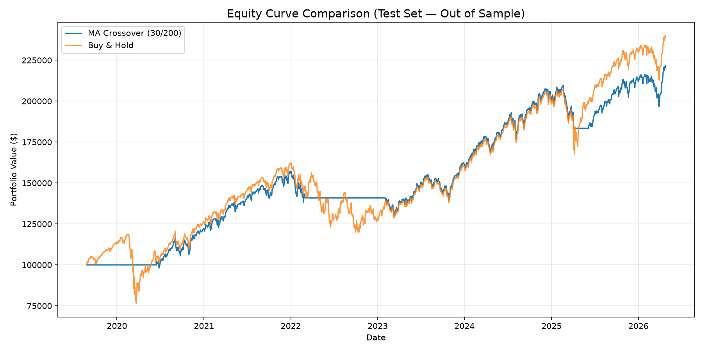

# SPY Moving Average Crossover — Backtest Report

> Generated: 2026-06-21 10:38

## Executive Summary

A dual simple-moving-average (SMA) crossover strategy was backtested on SPY daily data from **1993-01-29 → 2026-04-24** (8,366 trading days, ~33.2 years).

**Best parameters (selected on training set by Sharpe ratio):** Fast SMA = 30, Slow SMA = 200

**Test period (out-of-sample):** 2019-08-27 → 2026-04-24

On the out-of-sample test set, the strategy achieved a **Sharpe ratio of 1.08** vs **0.76** for Buy & Hold, with a **CAGR of 12.73%** vs **14.09%** for the benchmark.

## Data Overview

| Metric | Value |
|--------|-------|
| Date Range | 1993-01-29 → 2026-04-24 |
| Trading Days | 8,366 |
| ~Years Covered | 33.2 |
| Missing Values | 0 |
| Adj Close (First) | $24.18 |
| Adj Close (Last) | $713.12 |
| Adj Close Range | $23.88 – $713.12 |
| Avg Daily Volume | 83,285,872 |

## Strategy vs Benchmark (Test Set — Out of Sample)

| Metric | MA Crossover | Buy & Hold | Delta |
|--------|-------------|------------|-------|
| Total Return | 121.63% | 139.97% | -18.34% |
| CAGR | 12.73% | 14.09% | -1.36% |
| Annual Volatility | 11.77% | 20.09% | -8.32% |
| Sharpe Ratio | 1.08 | 0.76 | 0.32 |
| Max Drawdown | -17.16% | -35.75% | 18.58% |
| Win Rate | 100.00% | 100.00% | 0.00% |
| Profit Factor | inf | inf | nan |
| Number of Trades | 3 | 1 (buy once) | — |

## Equity Curve

## Parameter Grid Results (Training Set — In Sample)

| Fast SMA | Slow SMA | Sharpe Ratio | CAGR | Max DD | Win Rate | # Trades |
|----------|----------|-------------|------|--------|----------|---------|
| 30 | 200 | 0.72 | 8.6% | -19.6% | 71% | 14 |
| 10 | 200 | 0.70 | 8.1% | -19.6% | 56% | 25 |
| 50 | 200 | 0.69 | 8.4% | -20.7% | 69% | 13 |
| 50 | 150 | 0.69 | 8.2% | -22.2% | 74% | 19 |
| 20 | 200 | 0.68 | 7.9% | -19.6% | 65% | 20 |
| 50 | 100 | 0.62 | 7.1% | -22.5% | 64% | 28 |
| 10 | 100 | 0.60 | 6.5% | -34.4% | 51% | 45 |
| 10 | 150 | 0.59 | 6.5% | -29.4% | 55% | 44 |
| 30 | 150 | 0.59 | 6.7% | -27.9% | 58% | 24 |
| 20 | 150 | 0.58 | 6.5% | -32.9% | 55% | 29 |
| 20 | 100 | 0.48 | 5.1% | -38.4% | 48% | 40 |
| 30 | 100 | 0.45 | 4.8% | -44.5% | 51% | 37 |

## Observations & Limitations

- **Lookahead bias avoided:** All positions are lagged by 1 day relative to signals.
- **No transaction costs:** Slippage and commissions are not modelled; real-world results would be lower.
- **Long-only strategy:** The strategy only goes long or flat — no shorting.
- **100% position sizing:** The model assumes full allocation on every signal, no position sizing or risk management.
- **Single instrument:** Results are for SPY only. Diversification across sectors/asset classes is not considered.
- **Parameter robustness:** The best parameters on the training set may not persist out of sample. Walk-forward analysis would improve confidence.
- The classic golden cross (10/200) was included in the grid — the best parameters (30/200) may differ.
